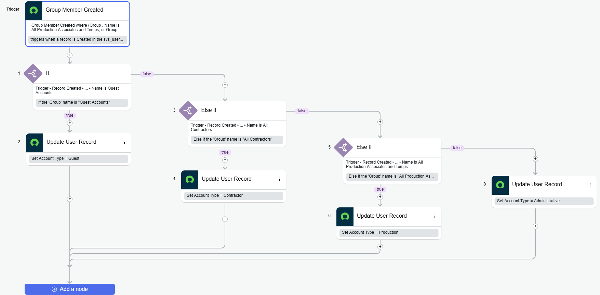

## Overview

In complex ServiceNow environments, identifying the specific "persona" of a user record is critical for security and user experience. This automation monitors the **Group Member** table to dynamically update a custom categorization field on the user profile.

### The Problem
Without an automated way to distinguish between employees, contractors, and guests:
* **Service Catalog** variables often display improper accounts in user-selection fields.
* **Security & ACLs** are difficult to enforce globally without a standardized attribute.
* **User Experience** suffers when internal tools and forms are cluttered with external account data.

### The Solution: Dynamic Categorization
By leveraging ServiceNow **Flow Designer**, we can listen for group additions and instantly tag the user record. This allows for granular filtering in Reference Qualifiers (e.g., `u_account_type!=Guest`) and specific portal access controls.

---

## Technical Implementation

### Custom Field Details
To support this logic, a custom field was added to the standard User table:
* **Table:** User `[sys_user]`
* **Field Name:** `u_account_type`
* **Type:** Choice List
* **Choices:** Guest, Contractor, Production, Administrative

### Flow Logic Diagram
The following diagram illustrates the conditional branching used to determine the account type:

### Logic Breakdown
1. **Trigger:** A record is created on the Group Member `[sys_user_grmember]` table.
2. **Conditional Logic:**
    * **IF** the group is **"All Guests"** &rarr; Set `u_account_type` to **"Guest"**.
    * **ELSE IF** the group is **"All Contractors"** &rarr; Set `u_account_type` to **"Contractor"**.
    * **ELSE IF** the group is **"All Production"** &rarr; Set `u_account_type` to **"Production"**.
    * **ELSE** &rarr; Set `u_account_type` to **"Administrative"**.

---

## Business Value & Benefits

### 1. Enhanced Security (ACLs)
Security Administrators can now write an  that targets the `u_account_type` field directly, ensuring that "Guest" or "Contractor" accounts do not have accidental access to sensitive ITIL modules, Knowledge Bases, etc.

### 2. Streamlined Service Catalog
By applying Reference Qualifiers to Catalog Variables, we can ensure that only "Administrative" or "Contractor" users are selectable for corporate hardware requests or other type of request variables.

### 3. Simplified Reporting
An organization can now generate real-time reports on workforce distribution. Understanding the ratio of Contracted Associates to Administrative staff helps in capacity planning and licensing audits.

---

### Implementation Notes
- **Persistence:** The flow is designed to update the user record immediately upon group assignment, ensuring the user's permissions and visibility are updated in real-time.
- **Scalability:** Additional groups can be added to the `Else If` logic to support new personas (e.g., "Vendors" or "Auditors") without disrupting the core flow.