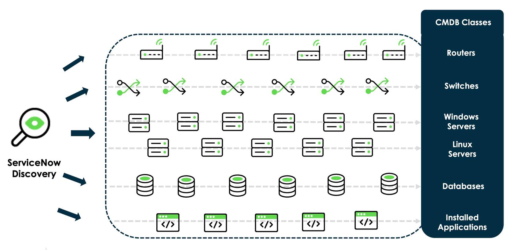
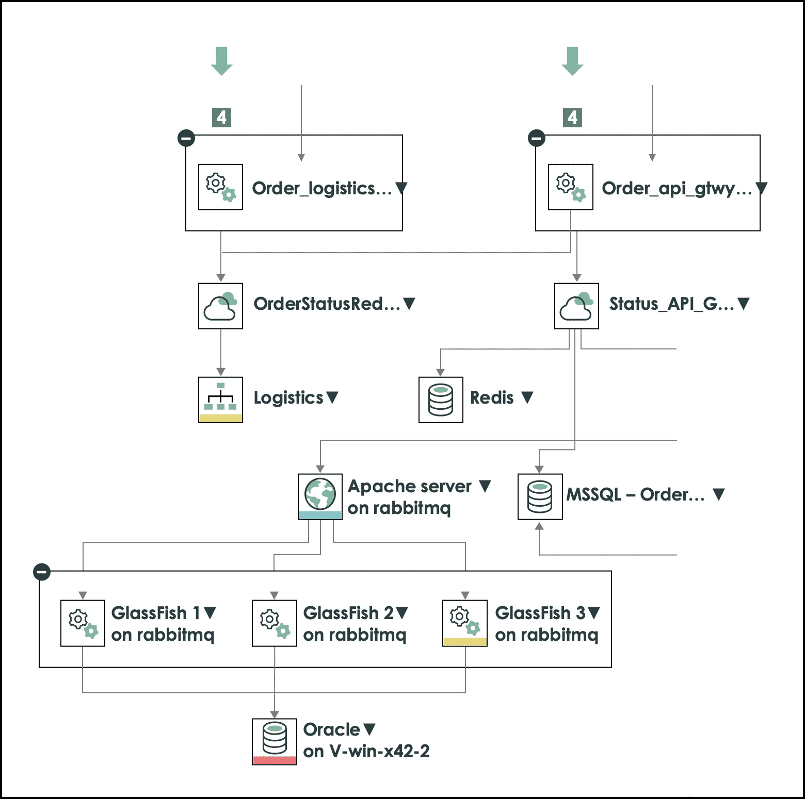
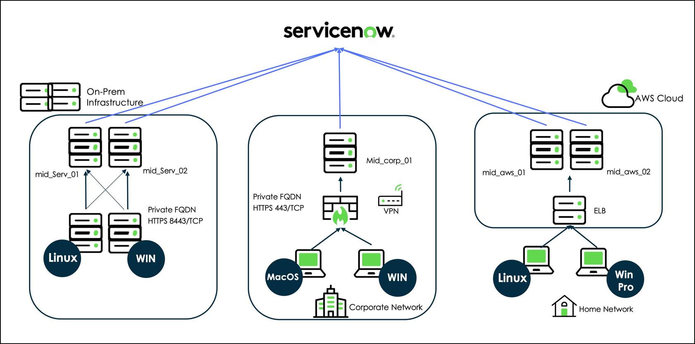
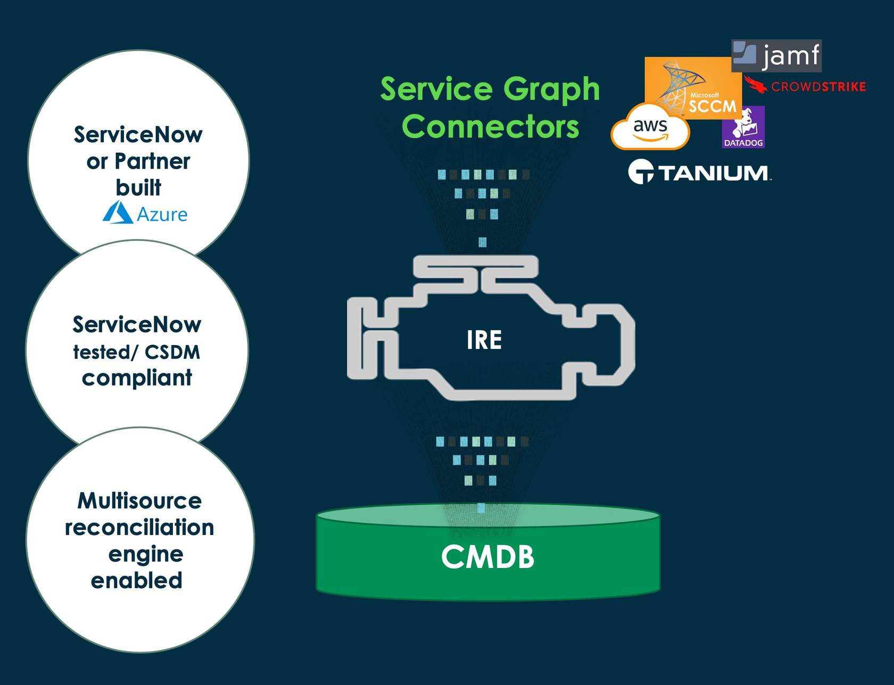
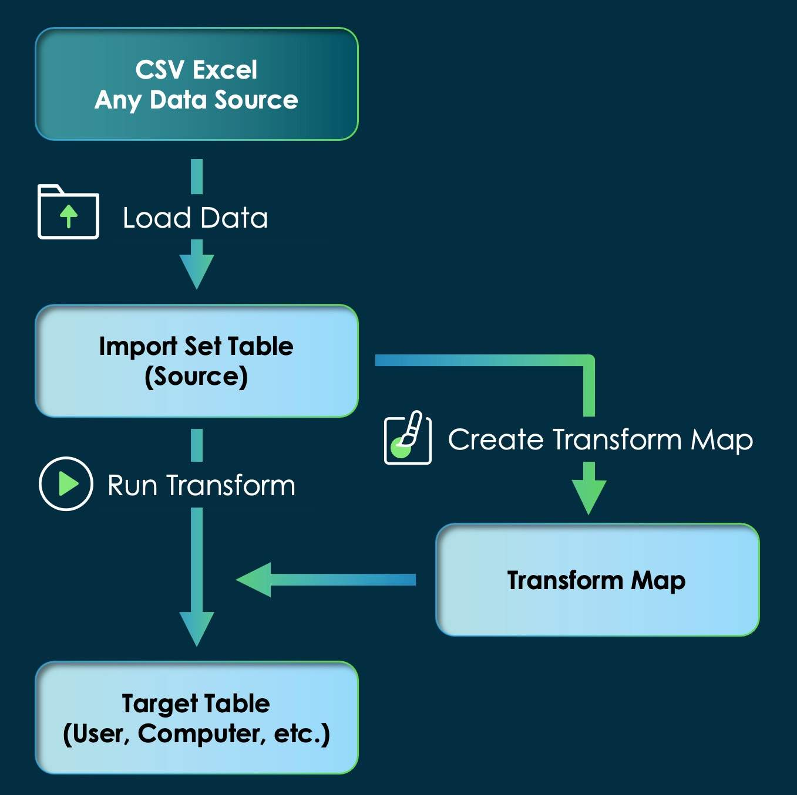

## Overview

A healthy Configuration Management Database (CMDB) depends on accurate, automated, and consistent data ingestion. ServiceNow provides multiple methods for populating the CMDB, ranging from native discovery tools to modern ETL frameworks and legacy import processes.

This guide outlines the primary ingestion methods and highlights best practices for maintaining data integrity using the Identification and Reconciliation Engine (IRE).

---

## CMDB Ingestion Methods

### 1. ServiceNow Discovery

ServiceNow Discovery is an agentless, IP-based solution that automatically identifies infrastructure components within a network. This type of discover is also referred to as **horizontal discovery** because it focuses on discovering devices and their relationships across the infrastructure layer.

**Capabilities**

- Identifies devices such as routers, switches, and servers  
- Discovers relationships and dependencies between configuration items (CIs)

**Discovery Phases**

1. **Scan**  
   Identifies active IP addresses via network probing.

2. **Classification**  
   Determines the device type via patterns (e.g., Windows, Linux, network device).

3. **Identification**  
   Checks whether the CI already exists in the CMDB. If it does, the record is updated; if not, a new CI is created.

4. **Exploration**  
   Collects detailed attributes and relationship data. Will complete more targeted discovery patterns based on the device such as WMI for Windows or SNMP for network devices.



---

### 2. Service Mapping

Service Mapping provides a **top-down view of business services**, mapping how infrastructure components support specific applications or services.

- Builds service maps dynamically  
- Updates relationships as the environment changes  
- Improves visibility into service dependencies and impact analysis  



---

### 3. Agent Client Collector (ACC)

The Agent Client Collector (ACC) uses an installed agent to provide detailed, real-time visibility into endpoint systems.

**Key Benefits**

- Collects software usage data for Software Asset Management (SAM)  
- Captures detailed hardware metrics (CPU, RAM, disk)  
- Provides configuration data such as OS patches and network settings  



---

### 4. Service Graph Connectors

Service Graph Connectors are pre-built integrations that ingest data from external systems such as Azure, SCCM/MECM, AWS, and Tanium.

- Standardized ingestion aligned with CMDB data models and CSDM
- Maintains consistency across multiple data sources
- Reduces the need for custom integration logic  



---

## IntegrationHub ETL (IH-ETL)

IntegrationHub ETL (IH-ETL) is a modern framework for importing and transforming external data into ServiceNow, with a strong focus on CMDB ingestion.

**Key Features**

- **Data Transformation**  
  Normalizes incoming data to align with the ServiceNow data model  

- **Automation**  
  Reduces manual intervention and ensures consistent ingestion  

- **IRE Integration**  
  Natively leverages the Identification and Reconciliation Engine to prevent duplicate records  

---

## Import Sets & Transform Maps

Import Sets are the legacy method for importing external data into ServiceNow.

### Standard Import Process

1. **Data Staging**  
   Data is loaded into an Import Set table from sources such as CSV, Excel, or APIs  

2. **Field Mapping**  
   Fields from the import table are mapped to target table fields  

3. **Transform Execution**  
   Data is processed and inserted into the target table using mappings and scripts  



### IH-ETL vs. Legacy Transform Maps

| Feature | IntegrationHub ETL | Legacy Transform Maps |
|---|---|---|
| **Ease of Use** | Guided and user-friendly | Requires manual mapping and scripting |
| **Data Integrity** | Native IRE support | Uses coalesce fields by default |
| **Targeting** | Optimized for CMDB/CSDM | General-purpose ingestion |
| **Logic Handling** | Built-in transformation functions | Relies on transform scripts |

---

## Using the IRE with Transform Maps

By default, Transform Maps rely on **coalesce fields** to determine uniqueness. This approach can lead to duplicate records when unique identifiers are inconsistent or distributed across multiple fields.

### Problem Scenario

In many real-world datasets:

- Some records may contain a **serial number**
- Others may only contain a **hostname**
- Not all records consistently populate both fields

Using coalesce in this scenario is problematic because:

- Coalesce expects a single consistent unique identifier  
- Missing values prevent proper matching  
- This can result in duplicate CI creation  

### Solution: Use the IRE

The Identification and Reconciliation Engine (IRE) uses **CI Identifiers**, which follow a prioritized matching approach:

1. Attempt to match using the highest-priority identifier (e.g., serial number)  
2. If unavailable, fall back to secondary identifiers (e.g., name)  

This ensures accurate CI matching even when data is incomplete or inconsistent.

---

## Implementing IRE in a Transform Map

To use the IRE with a Transform Map, an `onBefore` script must be added to call the `CMDBTransformUtil` API.

This bypasses the need for the coalesce logic and ensures all records are processed through the IRE.

### OnBefore Transform Script

```javascript
(function runTransformScript(source, map, log, target) {
    // Call CMDB API to perform Identification and Reconciliation
    var cmdbUtil = new CMDBTransformUtil();
    cmdbUtil.identifyAndReconcile(source, map, log);
    
    // Prevent standard transform processing
    ignore = true;
})(source, map, log, target);
```

## Summary

ServiceNow offers a suite of tools for CMDB data ingestion, each designed to meet specific architectural and business needs:

- **Automated Visibility:** Discovery and Service Mapping provide  agentless infrastructure visibility and top-down dependency mapping for business services, helping to maintain an accurate and dynamic CMDB.
- **Endpoint Insights:** The Agent Client Collector (ACC) delivers detailed, real-time data from endpoint systems, enhancing the granularity of CMDB records and supporting software asset management. Additionally allows the support of running commands for remediation or data collection purposes.
- **Modern Integrations**: Service Graph Connectors and IntegrationHub ETL (IH-ETL) offer structured, scalable frameworks for synchronizing data from third-party platforms like Azure, AWS, and SCCM while ensuring CSDM compliance and without the need to build custom integrations.
- **Legacy & Custom Workflows**: Import Sets and Transform Maps remain available for handling flat files or unique custom ingestion requirements, though they require manual configuration to maintain data integrity.

Regardless of the chosen method, leveraging the Identification and Reconciliation Engine (IRE) is critical to maintaining a "single source of truth" by preventing duplicate configuration items and managing data precedence. While no single tool fits every scenario, the optimal strategy depends on the frequency of updates, the complexity of the data source, and the specific governance requirements of your organization.
