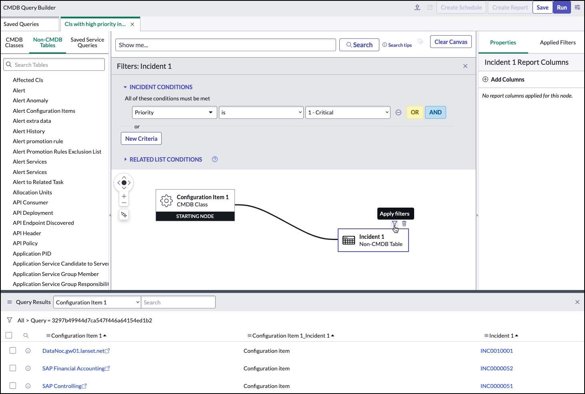
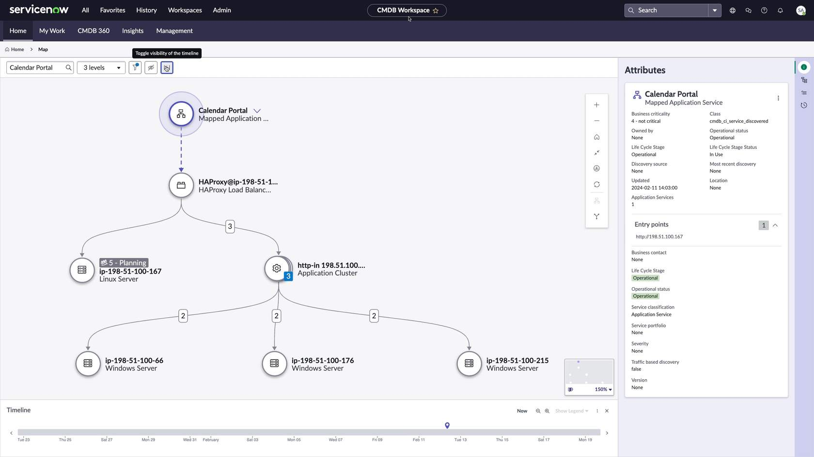
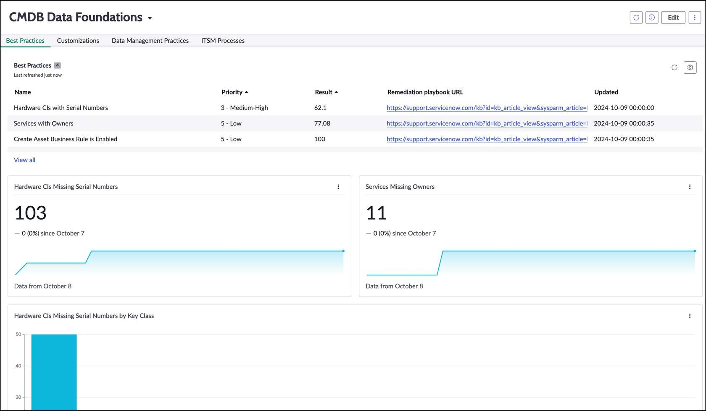

## Overview

Gaining insight into the ServiceNow CMDB helps organizations transform raw configuration data into actionable intelligence. By analyzing Configuration Items (CIs), relationships, and historical trends, teams can improve decision making, increase operational efficiency, and strengthen service management outcomes.

This guide outlines the primary methods for generating CMDB insights and highlights the tools that support reporting, visualization, impact analysis, and data quality governance.

---

## CMDB Insight Methods

### 1. Data Visualization

Data visualization provides a clear and intuitive way to understand CMDB data and relationships.

**Capabilities**

- Uses dashboards to provide real-time visibility into CI health, trends, and ownership
- Uses Unified Map to display CI relationships and dependency paths

**Value**

- Improves situational awareness
- Simplifies complex relationship data
- Enables faster operational decisions

---

### 2. Reporting and Querying

Reporting enables structured analysis of CMDB data to support governance, audit readiness, and operational performance.

**Capabilities**

- Uses Intelligent Search to quickly locate CIs and related records
- Uses CMDB Query Builder to create complex cross-table queries without SQL
- Supports reusable and scheduled queries for recurring analysis

**Value**

- Identifies compliance and data quality gaps
- Highlights trends and operational risk areas
- Supports repeatable governance reporting

### Example Use Cases

| Category | Objective |
|---|---|
| CMDB Relationships | Identify application services that depend on specific hardware components |
| Incident & Problem Management | Identify CIs associated with high-priority incidents |
| Change Management | Perform impact analysis to determine affected services |
| Performance | Analyze systems prone to bottlenecks or recurring issues |
| Software Asset Management | Identify licenses nearing expiration |
| Governance | Identify CIs older than 30 days without an owner or support group |

---

### 3. Impact Analysis

Impact analysis uses CI relationships to understand how incidents or changes can affect connected systems.

**Capabilities**

- Visualizes upstream and downstream dependencies
- Identifies blast radius for planned or unplanned events
- Supports risk based change planning and approval

**Value**

- Reduces change implementation risk
- Improves incident triage and resolution speed
- Strengthens dependency awareness across teams

---

### 4. CMDB Health and Data Foundations

CMDB Health and Data Foundations dashboards provide visibility into CMDB quality, structure, and CSDM alignment.

**Key Tools**

- CMDB Data Foundations Dashboard
- CSDM Data Foundations Dashboard

**Capabilities**

- Evaluates CMDB configuration and customization quality
- Identifies completeness, correctness, and compliance issues
- Provides guided remediation through playbooks and recommendations

**Value**

- Improves long term CMDB reliability
- Supports policy and model compliance
- Reduces risk from poor data quality and unmanaged customization

---

## Key Insight Tools



  
ServiceNow CMDB Query Builder enables teams to create and manage complex queries across CMDB and non-CMDB tables. Users can visually build queries to retrieve specific configuration items (CIs) and their relationships without writing SQL.

It is especially effective for multi-table, relationship-based queries and supports saving and scheduling queries for recurring analysis and reporting.

**Key Features**

- **Visual Interface**
  - Uses drag-and-drop query construction
  - No need for complex scripting or SQL expertise

- **Advanced Filtering**
  - Narrows results using CI attributes and relationship criteria
  - Supports AND/OR logic for precise query design

- **Reusable and Scheduled Queries**
  - Allows queries to be saved and reused
  - Supports scheduled execution for ongoing reporting and data analysis

  

  
ServiceNow Unified Map is a visualization tool that delivers an interactive, end-to-end view of configuration items (CIs) and their relationships in the CMDB. It helps teams understand dependencies, detect potential issues early, and manage change with greater confidence.

**Key Features**

- **Interactive Visualization**
  - Provides a visual representation of CIs and relationships
  - Supports zoom and pan to navigate complex service maps

- **Dependency Mapping**
  - Shows how CIs are connected and dependent on each other
  - Helps identify the impact of incidents or changes on related CIs

  

  
The ServiceNow CMDB and CSDM Data Foundations Dashboards help teams monitor, manage, and improve CMDB data quality and structure while staying aligned with CSDM standards.

The CMDB Data Foundations Dashboard assesses CMDB configurations and customizations to support data integrity and long-term platform stability.

**Key Features**

- **Visibility and Data Quality Monitoring**
  - Verifies that critical CMDB data is valid and properly configured
  - Provides visibility into data quality issues so teams can identify and correct gaps quickly

- **Policy Compliance**
  - Monitors compliance with governance policies and data standards
  - Highlights deviations that require corrective action

- **Risk Identification and Remediation Playbooks**
  - Identifies potential implementation risks that can impact CMDB stability
  - Provides guided playbooks and best practices to support remediation and ongoing governance

  



---

## Summary

ServiceNow provides multiple ways to generate actionable insight from CMDB data, each supporting different operational and governance outcomes:

- **Visualization and Context:** Dashboards and Unified Map help teams understand CI health, relationships, and dependencies in real time.
- **Reporting and Analysis:** Intelligent Search and CMDB Query Builder support repeatable, structured analysis for audits, operations, and planning.
- **Change and Incident Readiness:** Impact analysis improves risk management by identifying affected services before and during incidents or changes.
- **Data Governance:** CMDB Health and CSDM Data Foundations dashboards help maintain quality, compliance, and long-term CMDB stability.

When these methods are used together, the CMDB becomes a reliable source of truth that supports faster decisions, stronger governance, and better service outcomes.