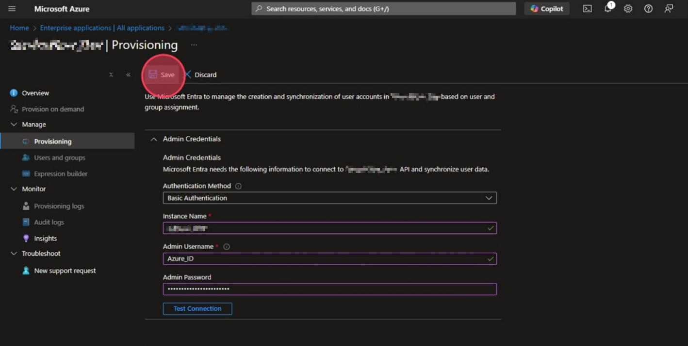
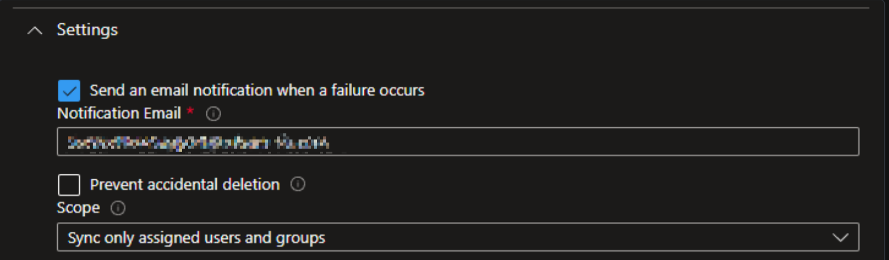
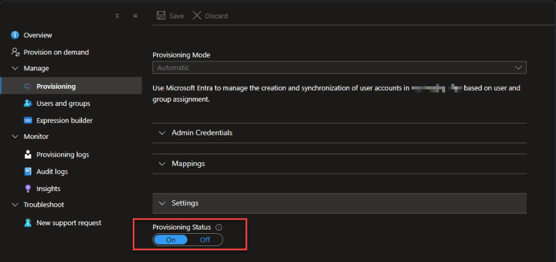

## Overview

Configuring automatic user and group provisioning from Microsoft Entra ID (formerly Azure AD) to ServiceNow ensures that identity data remains accurate and synchronized across your organization’s systems. This integration automates the lifecycle management of user accounts and group objects, reducing manual administrative effort while strengthening security through timely provisioning and deprovisioning.

By using Microsoft Entra ID as the authoritative identity source, organizations can enforce consistent access policies, maintain a single source of truth for user and group data, and streamline onboarding, role changes, and offboarding processes. Automated provisioning also minimizes the risk of orphaned accounts and access discrepancies, supporting compliance and governance requirements.

This guide provides step-by-step instructions for configuring provisioning from Microsoft Entra ID to ServiceNow. The synchronized attributes and group memberships established through this integration can later be leveraged within ServiceNow to automatically assign roles, categorize users, and further enhance identity driven automation.

## Prerequisites
* Administrative access to the Microsoft Entra admin center or set as an application owner for the ServiceNow enterprise application.
* A ServiceNow instance with a dedicated service account that has permissions to create, update, and delete user and group records.

---

## Technical Implementation

### 1. Enterprise Application Configuration
1. Navigate to the [Microsoft Entra Admin Center (Azure)](https://portal.azure.com/).
2. Search for and select **Enterprise Applications**.
3. Locate and select your **ServiceNow** application from the list.
4. In the left-hand navigation menu, select **Provisioning**.
5. Click **Get started** (or **Edit provisioning**) and set the **Provisioning Mode** to **Automatic**.

### 2. Admin Credentials & Connectivity
To establish the handshake between Entra ID and ServiceNow, configure the following under the **Admin Credentials** section:

* **ServiceNow Instance Name:** The sub-domain of your instance (e.g., `dev12345`).
* **Admin Username:** The service account username.
* **Admin Password:** The service account password.

Click **Test Connection** to verify that the Entra ID service can reach your ServiceNow instance. Once successful, click **Save**.

### 3. Notification & Operational Settings
Under the **Settings** section, configure failure alerts to ensure proactive monitoring:
* **Email Notification:** Check the box **Send an email notification when a failure occurs**.
* **Notification Email:** Enter the internal support or identity team email address.

### 4. Attribute Mapping
Customizing attribute mappings is essential for ensuring data lands in the correct fields (e.g., mapping Entra `jobTitle` to ServiceNow `title`). ServiceNow's `sys_user` and `sys_user_group` tables have specific schema requirements, so review and adjust the default mappings as needed. See below for guidance on user and group attribute mapping.

#### User Mappings
1. Under **Mappings**, click **Provision Microsoft Entra ID Users**.
2. Review the attribute list. Add or modify mappings to match your ServiceNow `sys_user` schema requirements.
3. Click **Save**.

Example mappings:
| ServiceNow | Microsoft Entra ID | Mapping Type | Matching Precedence |
|-----------------------------|-----------------------------|----------------|------------------|
| `user_name`                | `userPrincipalName`         | Direct | 1 |
| `first_name`               | `givenName`                 | Direct | |
| `last_name`                | `surname`                   | Direct | | 
| `email`                    | `mail`                      | Direct | | 
| `title`                    | `jobTitle`                  | Direct | | 
| `phone`                    | `telephoneNumber`            | Direct | |
| `department`               | `department`                | Direct | |
| `active`                   | `Switch([IsSoftDeleted], , "False", "1", "True", "0")`| Expression | |

#### Group Mappings
1. Under **Mappings**, click **Provision Microsoft Entra ID Groups**.
2. Map the Entra group attributes to the ServiceNow `sys_user_group` table.
3. Click **Save**.

Example mappings:
| ServiceNow | Microsoft Entra ID | Mapping Type | Matching Precedence |
|-----------------------------|-----------------------------|----------------|------------------|
| `name`                     | `displayName`               | Direct | 1 |
| `description`              | `description`               | Direct | |
| `email`                    | `mail`                      | Direct | |
| `u_entra_object_id`        | `id`                        | Direct | 2 |
| `user`                     | `members`                   | Direct | |
| `active`                   | `Switch([IsSoftDeleted], , "False", "1", "True", "0")`| Expression | |

#### Custom Attributes
By default ServiceNow Attributes shown for mapping are the default fields from the `sys_user` and `sys_user_group` tables scheme. If you have custom fields in ServiceNow that you want to populate, you can add them to the attribute mapping list by following these steps:

1. In the **Attribute Mapping** section, click on **Edit Attribute List** checkbox.
2. Click **Edit attribute list for ServiceNow**
3. Enter the details for the custom attribute (see below example for the sys_user_group table)

| Name | Type | Primary Key? | Required? | Multi-Value? | Referenced Object Attribute? |
|-----------------------------|-----------------------------|----------------|------------------|----------------|-----------------------------|
| `u_entra_object_id`        | String                      | False             | False             | False          | |

4. Click **Save** to add the custom attribute to the list of available attributes for mapping. You can now map this custom attribute to an Entra ID attribute in the same way as the default attributes.

---

## Finalizing Deployment

1. Navigate back to the **Provisioning** main page.
2. Click **Users and Groups** to review the list of users and groups in scope for provisioning. These users and groups will be created, updated, or deleted in ServiceNow based on their status in Entra ID.
3. Set the **Provisioning Status** toggle to **On**.
4. Click **Save** to initialize the cycle.


The initial synchronization can take anywhere from 20 minutes to several hours depending on the number of users and groups in scope. From then on, provisioning runs every 40 minutes to ensure ongoing synchronization.



 An easy way to test changes to attribute mappings is to use the **Provision on Demand** feature. This allows you to select specific users or groups and trigger provisioning immediately, rather than waiting for the next scheduled cycle.


---

## Appendix
* [Official Microsoft Entra ServiceNow Provisioning Tutorial](https://learn.microsoft.com/en-us/entra/identity/saas-apps/servicenow-provisioning-tutorial)