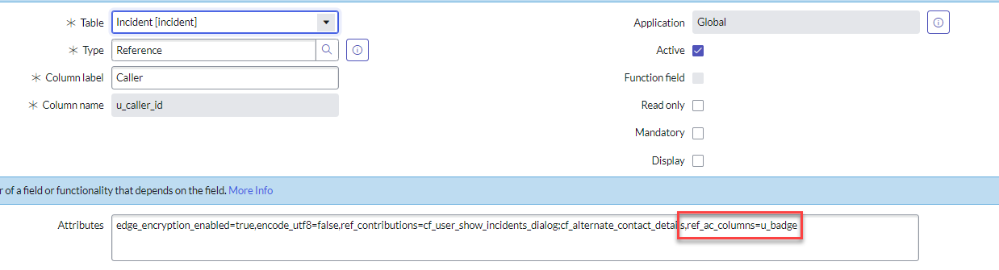
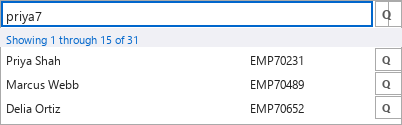
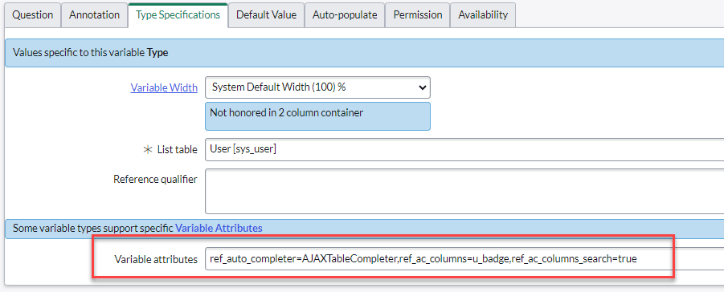
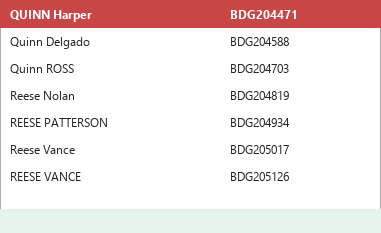

## Overview

By default, a reference field only displays one column of data: the field on the referenced table with **Display** set to `true` in the Dictionary Entry. Only one field per table can carry this flag, and it's typically the number or name field.

In many cases a single column isn't enough to disambiguate similar records (e.g., telling two users with the same name apart). ServiceNow lets you add extra columns to a reference field's auto-complete dropdown by setting the `ref_ac_columns` attribute, without changing the underlying Display field.

## Adding a Column to a Reference Field (Form Field)

1. Navigate to **System Definition > Dictionary** and open the reference field you want to modify (e.g., **Caller** on the Incident table, `u_caller_id`).
2. In the **Attributes** field, add the following, appending it to any existing attributes with a comma:

   ```
   ref_ac_columns=[field_name1],[field_name2]
   ```

3. Click **Update** to save the dictionary entry.

For example, adding a second column showing the `u_badge` field from `sys_user` to the Caller field on Incident:



**Result:**




The **Display** field itself is unaffected by `ref_ac_columns` — it's still what determines the value shown once a record is selected. `ref_ac_columns` only adds extra columns to the typeahead/search dropdown.


## Adding a Column to a Reference Variable (Service Portal / Catalog)

Reference and List Collector variables used on Service Portal catalog items require a different set of attributes, since they render through the AJAX table completer rather than the classic UI16 reference widget:

```
ref_auto_completer=AJAXTableCompleter,ref_ac_columns=[field_name],ref_ac_columns_search=true
```

1. Open the catalog item variable and go to the **Type Specifications** tab.
2. In **Variable attributes**, add the string above, substituting your field name.
3. Click **Update**.

Example, adding `u_badge` to a User `[sys_user]` reference variable:



**Before:**


**After:**




Setting `ref_ac_columns_search=true` also makes the added column searchable, so users can find a record by typing the badge number instead of the name.

