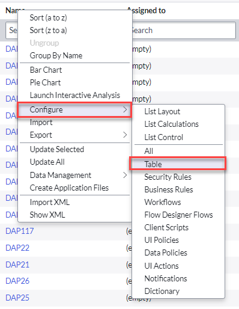
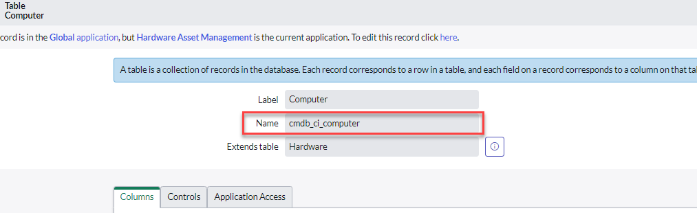
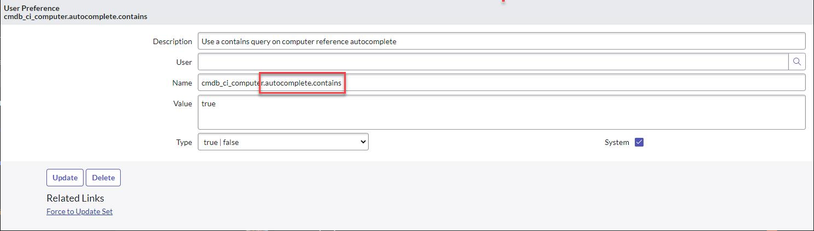

## Overview

By default, reference fields search using **"Starts with"** matching, so the only way to do a contains-style search from the field itself is to prefix the search term with `*`. However, you can create a **User Preference** record that makes a specific reference field's autocomplete use a contains search by default.

## Prerequisites

You must know the **table name**, not the label. If you don't already know it:

1. Navigate to the table you want to create this User Preference for.
2. Right-click any column header.
3. Click **Configure > Table**.

4. The table form loads, and the **Name** field shows the actual table name (e.g. `cmdb_ci_computer` for the Computer table).

## Creating the User Preference

1. Navigate to **All > User Administration > User Preferences**.
2. Click **New** (or open an existing preference record for the table).
3. Fill in the record as follows:
   - **Name**: `[table name].autocomplete.contains`
   - **Value**: `true`
   - **Type**: `true | false`
   - **System**: checked


Setting **System** ensures the preference applies instance-wide rather than only to the user who created it. Leave the **User** field empty for a system-wide setting.

