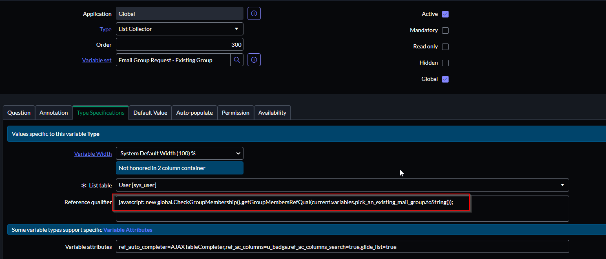

## Overview

Say a Catalog Item has a Reference variable pointing at the Group (`sys_user_group`) table, and a separate List Collector variable pointing at the User (`sys_user`) table. Whatever group is selected in the Reference variable, the List Collector should only offer that group's members as choices.

This isn't something a static reference qualifier can do, since the list of valid users depends on the group picked at runtime. Instead, use a **script include** as a dynamic reference qualifier on the List Collector field.

## Script Include

Create a Script Include that takes a group's sys_id and returns an encoded query of that group's members:

```javascript {linenos=table,filename="CheckGroupMembership.js"}
var CheckGroupMembership = Class.create();
CheckGroupMembership.prototype = {
    initialize: function() {},

    getGroupMembersRefQual: function(group_id) {
        if (gs.nil(group_id)) {
            return 'sys_id=NULL';
        }

        var memberIDs = [];
        var grMember = new GlideRecord('sys_user_grmember');
        grMember.addQuery('group', group_id);
        grMember.query();

        while (grMember.next()) {
            memberIDs.push(grMember.getValue('user'));
        }

        return 'sys_idIN' + memberIDs.join(',');
    },

    type: 'CheckGroupMembership'
};
```


Returning `'sys_id=NULL'` when no group is selected ensures the List Collector shows zero results instead of every user in the system.


## Configuring the List Collector

1. Navigate to the List Collector field on the Catalog Item's variable set.
2. Set the **Reference qualifier** to call the script include, passing in the Reference variable's name:

   ```
   javascript: new global.CheckGroupMembership().getGroupMembersRefQual(current.variables.your_group_variable_name.toString());
   ```

   Replace `your_group_variable_name` with the actual name of your Group reference variable.




The reference qualifier re-evaluates whenever the referenced variable's value changes, so as the user changes the selected group, the List Collector's available members update automatically without a page reload.

