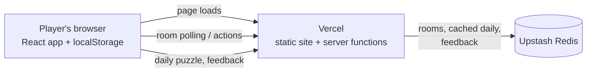

## Introduction

**Detour** ([playdetour.com](https://playdetour.com)) is a small arcade of browser games. Each game takes a few minutes to play, works on a phone, and needs no account and no install. Six games are live: **Wiki Race**, **Ultimate Tic-Tac-Toe**, **Recall**, **Lights Out**, **Spaced Out**, and **Minesweeper**.

I originally built it for my friends and me, and it has since grown into a full web app with daily puzzles, online multiplayer rooms, a shared design system, and an automated test and deployment pipeline. This page walks through how it's put together and the decisions behind it.


  **Play it live:** [playdetour.com](https://playdetour.com)  
  The source repository is private, so this page explains the architecture and includes only short excerpts rather than a full code walkthrough.


<video controls src="brag.mp4" title="Title"></video>

## Objectives

- Make games people can start in seconds: **no sign-up, no install, no tutorial wall**.
- Keep every game fast to play on a phone, including one-thumb play on a 360 px-wide screen.
- Add **daily puzzles** that are the same for everyone without running a database.
- Support **online play** for a couple of games without accounts.
- Build the site so that **adding a new game is a repeatable checklist**, not a rewrite.
- Keep a consistent look, feel, and voice across every game.

## The Games

| Game | Daily | Online | Modes |
| ---- | :---: | :----: | ----- |
| **Wiki Race** | Yes | Yes | Click from one Wikipedia article to a target. Daily pair, solo free play, or a room. |
| **Ultimate Tic-Tac-Toe** | No | Yes | Nine boards, one game. Play against a bot, a local second player, or an online room. |
| **Recall** | No | No | Repeat a growing pattern of colored pads. Endless solo, 3 to 8 colors. |
| **Lights Out** | Yes | No | A tap toggles a light and its neighbors; turn them all off. Daily 5×5, free play 3×3 to 7×7. |
| **Spaced Out** | Yes | No | Place one star per row, column, and region, with no two touching. Daily 7×7, free play 6×6 to 9×9. |
| **Minesweeper** | No | No | Classic mines with a safe first click. Easy, Medium, and Hard. |

## Tech Stack

| Layer | Technology |
| ----- | ---------- |
| Framework | **TanStack Start** (React 19, file-based routes, server routes for `/api/*`) |
| Build | **Vite** |
| Animation | `motion` |
| Hosting | **Vercel**, with server routes emitted as Vercel functions by Nitro |
| Shared state | **Upstash Redis** (online rooms, feedback, cached daily puzzle) |
| Player data | Browser `localStorage` |
| Unit tests | **Vitest** |
| End-to-end tests | **Playwright** |
| CI | GitHub Actions |

## Architecture

There is **no database and no sign-in**. Everything a player owns lives in their own browser. The server is only involved when players must share state (online rooms), when something is expensive to compute (one daily puzzle), or when a message has to be stored (feedback).



### Project structure

The layout is organized around the idea that **a game is a self-contained folder plus a manifest**:

```
src/
  routes/          File-based routes: home grid, one thin stub per game, API routes
  games/
    registry.ts    Discovers every game's manifest automatically
    <slug>/        One folder per game
      manifest.tsx   Copy, icon, card art, status, hasDaily
      engine/        Pure game rules, with tests beside them
      rooms/         Server-side room logic (online games only)
      styles.css     CSS scoped to that game
  components/detour/   Shared design system
  hooks/               Shared hooks (local stats, daily state, countdown, stored settings)
  lib/                 Dates, seeded randomness, safe storage, Redis client, room store
```

## Key Design Decisions

### 1. Games described by a manifest

Each game exports a **manifest**, a small description with its tagline, time estimate, colors, icon, status, route, how-to-play text, and whether it has a daily puzzle. A registry finds every manifest automatically, and the rest of the site is built from that list:

- The **home grid** renders one card per manifest, and the **Daily** filter is driven by the manifest's `hasDaily` flag.
- The **sitemap** and the check that every live game has a **social preview image** also read from the registry.
- Each game's route is a thin stub that builds its page metadata from the manifest.

The payoff is that adding a game doesn't mean editing the home page, the sitemap, and the SEO setup by hand.

### 2. Game rules kept separate from the UI

For five of the six games, the rules live in a pure `engine/` folder that has no UI in it, with unit tests beside it. The React components only render state and send player actions to the engine. This makes the logic, such as Minesweeper's safe first click or Lights Out scrambling, easy to test in isolation, and keeps it separate from the UI, and, for Ultimate Tic-Tac-Toe, from the bot, client, and room code that sit beside it. Wiki Race predates this layout and keeps its logic in a few files at the top of its folder, which is one of the cleanup items on my list.

### 3. A shared design system

Every game lives inside the same frame. `GameShell` provides the header with the game's icon, the how-to-play modal, and the footer, and a library of shared components covers the rest: buttons, badges, dialogs, toasts, a status bar, result cards, a confetti celebration, a sound toggle, and the feedback form. A `BRAND.md` document defines colors, type, motion, and voice, and each game gets its own accent color and tinted icon bubble from a single table.

Even the home-card art follows written rules (a fixed canvas size, consistent padding and stroke widths, and exactly one moving element), which keeps six different games looking like one product. Reduced-motion preferences are respected, for example by turning off the confetti.

### 4. No accounts: state lives on the device

Stats, streaks, personal bests, settings, and in-progress daily boards are all stored in `localStorage`, using a consistent naming scheme:

| Key pattern | Holds |
| ----------- | ----- |
| `detour-<game>-state` | Today's daily board (any other date is discarded) |
| `detour-<game>-stats` | Daily streak, games played and won, best daily score |
| `detour-<game>-best` | Free-play personal bests |
| `detour-<game>-sound` | Sound on or off |
| `detour-<game>-<setting>` | Last-used size, difficulty, or color count |

Storage access goes through a small wrapper that **never throws**, because `localStorage` can be unavailable (private browsing, blocked storage, full quota) and a game shouldn't crash over it.

The trade-off is that stats don't follow a player between devices. Since the goal was zero friction, I accepted that.

### 5. Daily puzzles without a database

The whole site agrees on "today" by using the **player's local calendar day**, through one helper, rather than UTC. Each daily game then uses the mechanism that fits it:

| Game | How the daily is produced |
| ---- | ------------------------- |
| **Wiki Race** | A date-seeded hash picks from a **curated list** of article pairs. A unit test guards against duplicates. |
| **Lights Out** | The 5×5 puzzle is **generated on the client** by scrambling a board with a PRNG seeded from the game name and date. It's cheap, so no server is needed. |
| **Spaced Out** | The 7×7 puzzle is **generated on the server and cached**. Generation includes a uniqueness check, which is slow, so the first request stores the board and everyone else gets the same one. |

Spaced Out's flow has the most moving parts:

1. The client requests the day's board from an API route.
2. The server stores it in Redis for 72 hours. If two requests race, **the first writer wins**, so everybody sees the same puzzle. The response is also CDN-cacheable.
3. The generator is **deterministic** for a given date. If Redis isn't available, or the request fails or takes longer than four seconds, the client generates the same board itself.

Changing a game's seed or generator would reshuffle all of its future dailies, so those are treated as fixed once shipped.

### 6. Online rooms without WebSockets or accounts

Ultimate Tic-Tac-Toe and Wiki Race offer online rooms, built on one shared, game-agnostic room store. Each game supplies only its own rules.

- **Storage:** each room is a Redis hash with a **24-hour expiry**.
- **Concurrency:** every write is a **compare-and-set on a version number**, done atomically in a Lua script, so two players acting at once can't overwrite each other.
- **Trust:** the **server validates every action**. Clients send intent, not results.
- **Sync:** clients **poll about once a second** instead of holding WebSocket connections, which keeps the server side simple.
- **Identity:** a random `playerId` is generated once and kept in `localStorage`. It is never shown to other players, so there's nothing to sign in to.

Polling costs a small amount of latency compared with WebSockets, which is a fine trade for turn-based games like these.

### 7. Anonymous feedback

The footer's **Feedback** link opens a form that sends a message to an API route. Only the text (up to 2,000 characters) and a UTC timestamp are stored, with no account, email, or identifier attached. A hidden **honeypot** field helps drop bots.

## Testing and Deployment

**Testing.** Unit tests live next to the code they cover. Each game's engine has tests, Ultimate Tic-Tac-Toe also tests its bot and room logic, Wiki Race tests its room service, and shared helpers like the date and seed utilities are covered too. A **Playwright smoke test** visits every route, including each game mode, so a broken page is caught before it ships.

**CI/CD.** GitHub Actions runs typecheck, lint, a formatting check, the preview-image check, unit tests, and a production build on every pull request and every push to `main`. Vercel's GitHub integration then deploys `main` to production, and **every PR gets its own preview deployment**.

## Summary

Detour started as a way to play quick games with friends and became a small but ever growing product: a game registry, a shared design system, account-free persistence, date-seeded daily puzzles, Redis-backed multiplayer with server-side validation, and a CI pipeline that tests and deploys every change. The through-line is keeping each piece simple and making the failure cases explicit.