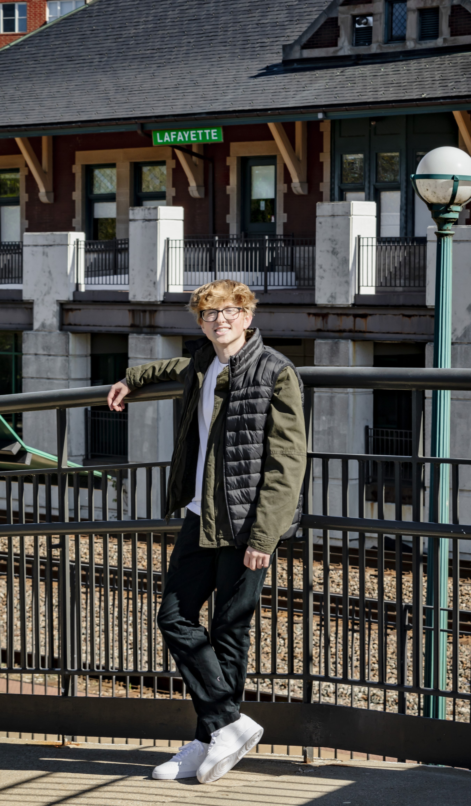

# 


  

    <h2>Welcome! 👋</h2>
    

      I'm <strong>Konner Lester</strong>, an undergraduate student at Purdue University majoring in <a href="https://polytechnic.purdue.edu/degrees/computing-infrastructure-and-network-engineering-technology" target="_blank">Computing Infrastructure and Network Engineering Technology</a>. I'm passionate about building scalable systems, automating workflows, and creating efficient IT solutions.
    

    

      My journey combines hands-on experience from industry internships with academic rigor, giving me a unique perspective on both theoretical foundations and real-world applications. Whether it's designing ServiceNow integrations, managing high-performance computing infrastructure, or architecting homelab environments, I'm driven by the challenge of solving complex technical problems.
    

  

## Experience



## Skills


Here are a few of the core technologies and platforms I work with:

  ServiceNow
  Docker
  Python & JavaScript
  Network Virtualization
  Active Directory
  Ceph Storage
  VDI & Thin Clients
  REST API
  Linux
  Git & CI/CD

---
## Explore More

Explore my projects and documentation to see the technologies I work with and the solutions I've built. From enterprise IT systems to personal infrastructure projects, each showcases different aspects of my technical journey.







  <h2>Let's Connect</h2>
  

    I'm always interested in connecting with fellow tech enthusiasts, potential mentors, and industry professionals. Whether you want to discuss technology, collaborate on a project, or just say hello, I'd love to hear from you!
  

  

    
    
  

